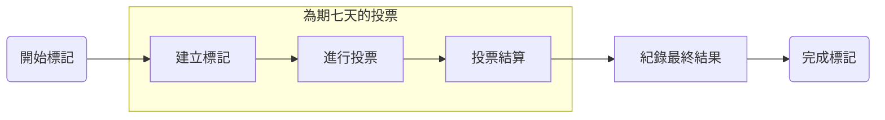
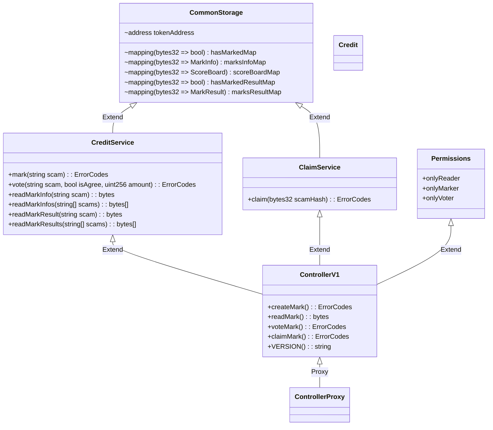

# appworks.blockchains.final.project

## Description

這個專案想做鏈上版的 Whoscall, 可以對可疑的 email 或是 domain 做辨識以及防範, 透過持有平台代幣, 每個人都可以參與 `標記` , `投票`, `結算`及`辨識`
在建立標記後, 就進入投票機制的環節, 投票區分 `agree` 和 `against` 兩方, 不論參與哪方都可以投入不限制數量的平台代幣, 投入代幣後會經過平方根計入分數內, 如下
```
# agree 有兩位投票者, 分別投了 100, 400 顆平代幣, 平方根後加總的分數是 30
- agree [100, 400] => score: 30

# against 有一位投票者, 投了 625 顆平代幣, 平方根後分數是 25
- against [625] => socre: 25
```
因此最後進行到結算的環節時, 會返回投 agree 使用者初始 deposit 的數量以及系統獎勵, 而一開始被標記的資訊也會因為 agree 分數較高, 被標記為可疑, 提供辨識及防範

## Functional
- 儲值: 初始沒有 Token 時，沒辦法兌換票數進行投票，因此需要先儲值
- 建立標記: 使用者可以對可疑的 email 或是 domain 進行標記
- 參與投票: 使用者可以在對已經被標記的資訊投票
- 結算投票: 在經過指定日期後的標記資訊的投票, 可以被結算
- 角色驗證: 上方各個功能都需要持有最少指定數量的Token, 才能發起

## Flow


## Framework
- Credit: 做為平台幣使用，實現 ERC-20 標準, 作為後續 投票, 獎勵 使用
- ControllerV1: 作為對外公開介面的核心合約，繼承 ClaimService, CreditService
- ControllerProxy: proxy 合約, 用於 proxy Controller 合約
- ClaimService: 實作投票後結算, 返還, 獎勵, 沒收 Credit 的功能
- CreditService: 實做 標記, 投票, 讀取 的功能
- Permissions: 驗證各角色的權限
- CommomStroage: 作為 ClaimService 以及 CreditService 共用的 Stroage 配置

